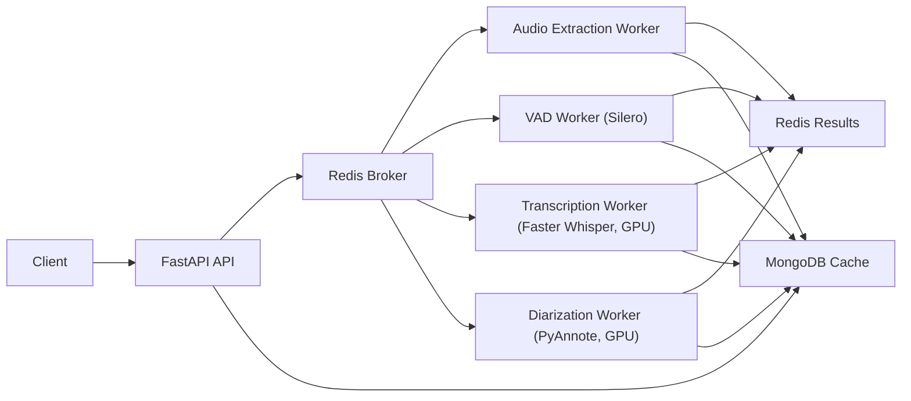

# Сервис транскрибирования аудио- и видеозаписей

Cервис развернут на http://ml-platform-big.company.loc:9204

Система для автоматического транскрибирования аудио- и видеозаписей с распознаванием говорящих. Использует современные модели машинного обучения для высокоточного распознавания речи и определения спикеров.

## Особенности

- Полноценное транскрибирование аудио и видео с распознаванием говорящих
- Микросервисная архитектура для масштабируемости
- Поддержка различных форматов аудио и видео
- Интеграция с Redis для управления задачами
- Поддержка GPU для ускорения обработки
- REST API для интеграции с внешними приложениями

## Архитектура системы



Система состоит из следующих компонентов:

1. **API сервер** - предоставляет REST API для взаимодействия с системой
2. **Рабочие процессы (Workers)** - отдельные сервисы для выполнения специфических задач:
   - **Audio Extraction Worker** - извлечение аудио из видеофайлов
   - **VAD Worker** - определение активных участков речи (Voice Activity Detection)
   - **Transcription Worker** - транскрибирование речи с использованием модели Faster Whisper
   - **Diarization Worker** - распознавание говорящих (speaker diarization)

Все рабочие процессы используют Redis для обмена сообщениями и Celery для планирования задач.

## Технологии и зависимости

- **Backend**: Python 3.10+
- **Фреймворк**: FastAPI
- **Обработка задач**: Celery + Redis
- **Транскрибирование**: Faster Whisper (CTranslate2)
- **Диаризация**: PyAnnote Audio
- **VAD**: Silero VAD
- **Контейнеризация**: Docker + Docker Compose
- **База данных**: MongoDB
- **GPU Acceleration**: NVIDIA CUDA

## Структура проекта

```
.
├── docker/                 # Docker-файлы для контейнеризации сервисов
├── models/                 # Модели машинного обучения
│   ├── pyannote-speaker-diarization-community-1/  # Модель диаризации
│   └── silero_vad_v6.2/        # Модель VAD
├── notebooks/              # Jupyter ноутбуки для тестирования
├── src/                    # Исходный код
│   ├── api/                # API сервер
│   ├── common/             # Общие компоненты
│   └── workers/            # Рабочие процессы
└── docker-compose.yml      # Конфигурация Docker Compose
```

## Установка и запуск

### Требования

- Docker и Docker Compose
- NVIDIA GPU с поддержкой CUDA (для ускоренной обработки)
- Не менее 8 ГБ оперативной памяти

### Шаги запуска

1. Клонируйте репозиторий:
```bash
git clone <repository-url>
cd speech-to-text
```

2. Установите зависимости:
```bash
make install
```

3. Запустите систему:
```bash
make run
```

Или для интерактивного режима:
```bash
make run-interactive
```

### Остановка системы

```bash
make stop
```

### Просмотр логов

```bash
make logs
```

## API Интерфейс

Система предоставляет REST API для взаимодействия:

### Основные эндпоинты

- `POST /api/upload` - загрузка медиафайла для транскрибирования
- `GET /api/status/{task_id}` - получение статуса задачи
- `GET /api/result/{task_id}` - получение результата транскрибирования

### Пример использования

```python
import requests

# Загрузка файла
files = {'file': open('audio.mp3', 'rb')}
response = requests.post('http://localhost:9204/api/upload', files=files)

# Получение результата
task_id = response.json()['task_id']
result = requests.get(f'http://localhost:9204/api/result/{task_id}')
```

## Модели

### Транскрибирование
- Модель: Faster Whisper Large v3 Turbo CT2
- Поддерживает множество языков

### Диаризация
- Модель: PyAnnote Speaker Diarization Community 1
- Распознавание говорящих в многолюдных разговорах

### VAD (Voice Activity Detection)
- Модель: Silero VAD v6.2
- Определение активных участков речи

## Настройка окружения

Перед запуском необходимо установить переменные окружения в `.env` файле или передать их при запуске:

- `MONGO_URI` - URI подключения к MongoDB
- `APP_PORT` - порт для API сервера (по умолчанию 9204)
- `ADMIN_PANEL_PORT` - порт для админпанели Flower (по умолчанию 9205)
